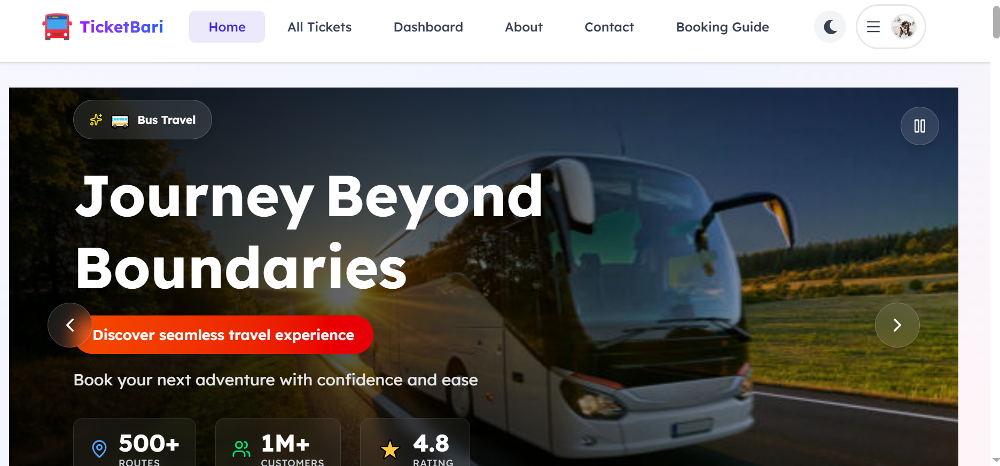
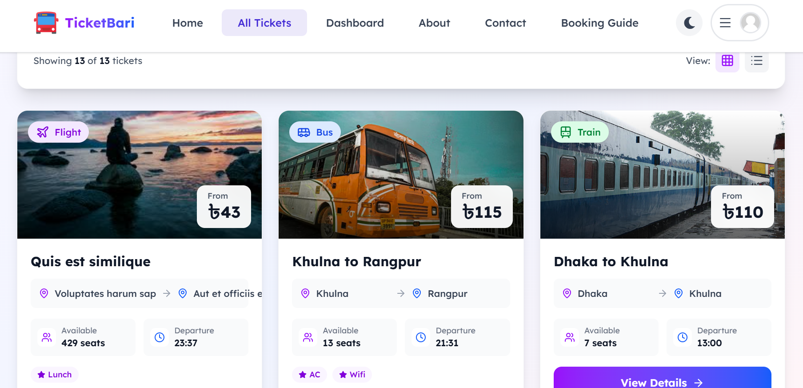
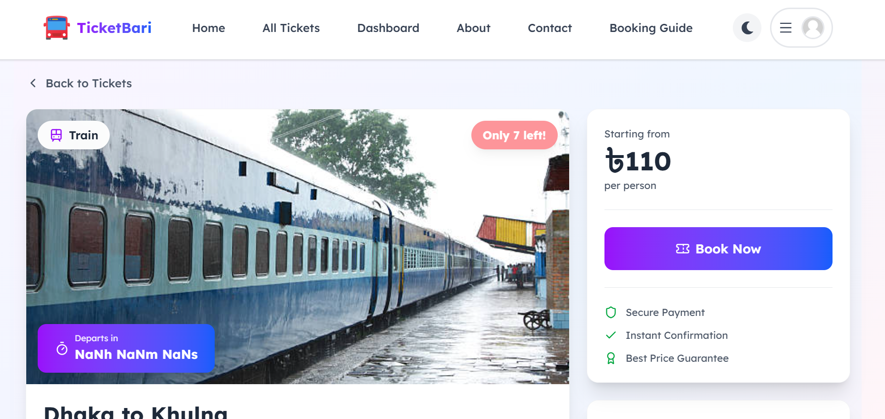
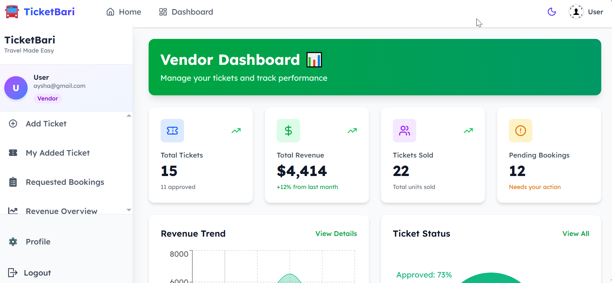
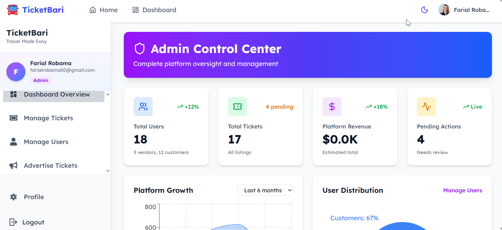

<div align="center">


# 🎫 TicketBari

### Modern Online Ticket Booking Platform for Bangladesh

**Book Bus · Train · Launch · Flight tickets — all in one place.**

[](https://ticketbari-client.web.app/)
[](https://github.com/farial-robama/TicketBari-Client)
[](https://github.com/farial-robama/TicketBari-Server)
[](LICENSE)


> ⚠️ **Note:** The backend is hosted on Vercel's free tier. First load after inactivity may take **5–10 seconds** due to cold start.

</div>

---

## 📑 Table of Contents

- [Overview](#-overview)
- [Screenshots](#-screenshots)
- [Features](#-features)
- [Tech Stack](#️-tech-stack)
- [Project Structure](#-project-structure)
- [Getting Started](#-getting-started)
  - [Prerequisites](#prerequisites)
  - [Environment Variables](#environment-variables)
  - [Installation](#installation)
- [API Reference](#-api-reference)
- [Security](#-security)
- [Performance](#-performance)
- [Roadmap](#-roadmap)
- [Contributing](#-contributing)
- [License](#-license)
- [Author](#-author)

---

## 📖 Overview

**TicketBari** is a full-stack ticket booking platform built with the MERN stack. It lets Bangladeshi travelers search, book, and pay for Bus, Train, Launch, and Flight tickets — all from a single interface.

The platform serves three roles:
- **Customers** browse and book verified tickets with Stripe-powered payments
- **Vendors** list tickets, manage inventory, and track revenue via analytics
- **Admins** verify listings, manage users, and control homepage advertisements

---

## 🖼️ Screenshots

| Homepage | Ticket Listing | Booking Flow |
|----------|---------------|--------------|
|  |  |  | 

| Vendor Dashboard | Admin Panel |
|-----------------|-------------|
|  |  |

---

## ✨ Features

### 🔐 Authentication & Security
- Email/Password registration with validation (uppercase, lowercase, 6+ chars)
- Google OAuth single sign-on via Firebase
- JWT token-based API protection
- Role-based access control (Customer / Vendor / Admin)
- Protected routes per role

### 👤 Customer
- Search tickets by origin, destination, and transport type
- Real-time seat availability and live departure countdown
- Book multiple tickets in one transaction
- Track bookings: Pending → Accepted → Paid
- Stripe payment integration with digital confirmation
- Full transaction history with timestamps

### 🏪 Vendor
- Add tickets with image upload (ImgBB API)
- Edit and delete listings
- Track verification status: Pending / Approved / Rejected
- Accept or reject incoming booking requests
- Revenue analytics with Recharts (total revenue, tickets sold)

### 👨‍💼 Admin
- Approve or reject vendor ticket submissions
- Manage all users: assign roles, suspend accounts, flag fraud
- Select up to 6 tickets for homepage advertisement slots

### 🏠 Public Pages
- Hero slider (Swiper.js) with featured tickets
- Advanced search: filter by route, transport type, price (asc/desc)
- Pagination (9 tickets/page), grid/list toggle
- Ticket detail page with map, vendor info, and booking interface
- Blocks booking for past departures and sold-out tickets

### 🎨 UI/UX
- Purple-blue gradient theme with glassmorphism effects
- Framer Motion animations throughout
- Dark / Light mode with system preference detection and persistent storage
- Mobile-first responsive design
- Toast notifications, loading spinners, and error states

---

## 🛠️ Tech Stack

### Frontend
| Technology | Purpose |
|---|---|
| React 18 | UI library |
| Vite | Build tool and dev server |
| Tailwind CSS + DaisyUI | Styling and components |
| React Router v6 | Client-side routing |
| TanStack Query | Server state and caching |
| Framer Motion | Animations |
| Firebase Auth | User authentication |
| Stripe.js | Payment processing |
| Axios | HTTP client |
| React Hook Form | Form validation |
| Recharts | Data visualization |
| Swiper.js | Touch slider |
| Lucide React | Icons |

### Backend
| Technology | Purpose |
|---|---|
| Node.js + Express.js | Server and API |
| MongoDB + Mongoose | Database and ODM |
| Firebase Admin SDK | Token verification |
| Stripe API | Payment gateway |
| Multer | File uploads |
| JWT | Auth tokens |
| CORS | Cross-origin handling |

### Services
| Service | Purpose |
|---|---|
| Firebase | Auth and frontend hosting |
| MongoDB Atlas | Cloud database |
| Stripe | Payment processing |
| ImgBB | Image hosting |
| Vercel | Backend deployment |

---

## 📁 Project Structure

```
TicketBari-Client/
├── public/
├── src/
│   ├── assets/
│   ├── components/
│   │   ├── Bookings/
│   │   │   ├── BookingCard.jsx
│   │   │   └── PaymentModal.jsx
│   │   ├── Dashboard/
│   │   │   ├── BookingCard/
│   │   │   ├── CheckoutForm/
│   │   │   ├── Menu/
│   │   │   │   ├── AdminMenu.jsx
│   │   │   │   ├── CustomerMenu.jsx
│   │   │   │   ├── MenuItem.jsx
│   │   │   │   └── VendorMenu.jsx
│   │   │   └── Sidebar/
│   │   ├── Home/
│   │   │   ├── Banner.jsx
│   │   │   ├── Features.jsx
│   │   │   ├── LatestTickets.jsx
│   │   │   ├── PopularRoutes.jsx
│   │   │   ├── Statistics.jsx
│   │   │   ├── Testimonials.jsx
│   │   │   └── WhyChooseUs.jsx
│   │   ├── Shared/
│   │   │   ├── Button/
│   │   │   ├── Footer/
│   │   │   ├── Navbar/
│   │   │   ├── Container.jsx
│   │   │   └── LoadingSpinner.jsx
│   │   └── TicketCard/
│   ├── firebase/
│   │   └── firebase.config.js
│   ├── hooks/
│   │   ├── useAuth.jsx
│   │   ├── useAxiosSecure.jsx
│   │   └── useRole.jsx
│   ├── layouts/
│   │   ├── DashboardLayout.jsx
│   │   └── MainLayout.jsx
│   ├── pages/
│   │   ├── Dashboard/
│   │   │   ├── Admin/
│   │   │   │   ├── AdminDashboard.jsx
│   │   │   │   ├── AdvertiseTickets.jsx
│   │   │   │   ├── ManageTickets.jsx
│   │   │   │   └── ManageUsers.jsx
│   │   │   ├── User/
│   │   │   │   ├── MyBookedTickets.jsx
│   │   │   │   ├── TransactionHistory.jsx
│   │   │   │   ├── UserDashboard.jsx
│   │   │   │   └── UserProfile.jsx
│   │   │   └── Vendor/
│   │   │       ├── AddTicket.jsx
│   │   │       ├── MyAddedTickets.jsx
│   │   │       ├── RequestedBookings.jsx
│   │   │       ├── RevenueOverview.jsx
│   │   │       └── VendorDashboard.jsx
│   │   ├── AllTickets/
│   │   ├── Home/
│   │   ├── Login/
│   │   ├── SignUp/
│   │   ├── TicketsDetails/
│   │   └── ErrorPage.jsx
│   ├── providers/
│   │   ├── AuthContext.jsx
│   │   └── AuthProvider.jsx
│   ├── routes/
│   │   ├── AdminRoute.jsx
│   │   ├── PrivateRoute.jsx
│   │   ├── Routes.jsx
│   │   └── VendorRoute.jsx
│   ├── utils/
│   │   └── index.js
│   ├── App.jsx
│   └── main.jsx
├── .env.local              # Local environment variables (not committed)
├── .env.example            # Template for environment variables ✅
├── .gitignore
└── package.json
```

---

## 🚀 Getting Started

### Prerequisites

Make sure you have the following installed:

| Tool | Version |
|---|---|
| Node.js | v18+ |
| npm | v9+ |
| Git | Any recent version |

You will also need accounts for:
- [Firebase](https://console.firebase.google.com/) — create a project and enable **Authentication** (Email/Password + Google)
- [MongoDB Atlas](https://cloud.mongodb.com/) — create a free cluster
- [Stripe](https://dashboard.stripe.com/) — get your test API keys
- [ImgBB](https://api.imgbb.com/) — get a free API key

---

### Environment Variables

**Never commit real credentials.** Copy the example files and fill in your own values.

#### Frontend (`TicketBari-Client/.env.local`)

```bash
cp .env.example .env.local
```

| Variable | Description |
|---|---|
| `VITE_FIREBASE_API_KEY` | Firebase project API key |
| `VITE_FIREBASE_AUTH_DOMAIN` | Firebase auth domain |
| `VITE_FIREBASE_PROJECT_ID` | Firebase project ID |
| `VITE_FIREBASE_STORAGE_BUCKET` | Firebase storage bucket |
| `VITE_FIREBASE_MESSAGING_SENDER_ID` | Firebase messaging sender ID |
| `VITE_FIREBASE_APP_ID` | Firebase app ID |
| `VITE_API_URL` | Backend server base URL |
| `VITE_IMGBB_API_KEY` | ImgBB image hosting API key |
| `VITE_STRIPE_PUBLISHABLE_KEY` | Stripe publishable key (starts with `pk_`) |

Create a `.env.local` file in the project root with the variables listed above.

#### Backend (`TicketBari-Server/.env`)

```bash
cp .env.example .env
```

| Variable | Description |
|---|---|
| `PORT` | Server port (default: `5000`) |
| `MONGODB_URI` | MongoDB Atlas connection string |
| `CLIENT_DOMAIN` | Frontend URL for CORS |
| `FB_SERVICE_KEY` | Firebase service account JSON encoded as base64 |
| `STRIPE_SECRET_KEY` | Stripe secret key |

Create a `.env.local` file in the project root with the variables listed above.

---

### Installation

#### 1. Clone both repositories

```bash
git clone https://github.com/farial-robama/TicketBari-Client.git
git clone https://github.com/farial-robama/TicketBari-Server.git
```

#### 2. Set up the Backend

```bash
cd TicketBari-Server
npm install
cp .env.example .env
# Fill in your values in .env
npm start
# Server runs at http://localhost:5000
```

#### 3. Set up the Frontend

```bash
cd TicketBari-Client
npm install
cp .env.example .env.local
# Fill in your values in .env.local
npm run dev
# App runs at http://localhost:5173
```

---

## 📡 API Reference

Base URL: `https://ticket-bari-online-ticket-booking-p.vercel.app`

All protected routes require a `Bearer <JWT>` token in the `Authorization` header.

---

## 🔒 Security

| Measure | Implementation |
|---|---|
| Authentication | Firebase ID Token verification on all protected routes |
| Authorization | Role-based access control (Customer / Vendor / Admin) |
| Ownership Validation | Vendors can only edit or delete their own tickets |
| Payment | PCI-compliant Stripe integration |
| Transport | HTTPS / SSL on all endpoints |
| Input Validation | `ObjectId.isValid()` checks on all ID parameters |
| Duplicate Prevention | MongoDB unique index on seat + ticket for active bookings |
| CORS | Restricted to client domain via environment variable |
| Secrets | All credentials stored in environment variables, never hardcoded |

---

## ⚡ Performance

- **Caching** — TanStack Query cache with stale-while-revalidate
- **Build Optimization** — Vite production minification and tree shaking
- **CDN** — Firebase Hosting serves frontend via global CDN
- **DB Indexing** — MongoDB indexes on frequently queried fields

---

## 🗺️ Roadmap

- [ ] SMS/email notifications on booking status changes
- [ ] Seat selection map for buses and trains
- [ ] Multi-language support (Bangla / English)
- [ ] Mobile app (React Native)
- [ ] Vendor payout dashboard with bank transfer support

---

## 🤝 Contributing

Contributions are welcome! Please follow these steps:

1. Fork the repository
2. Create a feature branch: `git checkout -b feature/your-feature-name`
3. Commit using conventional commits: `git commit -m "feat: add seat selection map"`
4. Push to your fork: `git push origin feature/your-feature-name`
5. Open a Pull Request against `main`

**Branch naming:** `feature/`, `fix/`, `chore/`, `docs/`  
**Commit style:** Follow [Conventional Commits](https://www.conventionalcommits.org/)

Please open an issue first for major changes.

---

<!-- ## 📄 License

This project is licensed under the [MIT License](LICENSE). -->

---

## 👤 Author

**Farial Robama**

[](https://github.com/farial-robama)
[](https://linkedin.com/in/farial-robama)
[](mailto:farialrobama15@gmail.com)

---

<div align="center">

Made with ❤️ in Bangladesh

⭐ Star this repo if you found it helpful!

[🐛 Report Bug](https://github.com/farial-robama/TicketBari-Client/issues) · [💡 Request Feature](https://github.com/farial-robama/TicketBari-Client/issues)

</div>